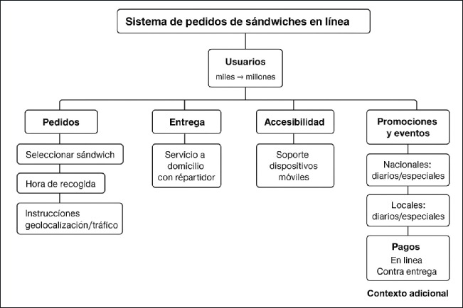
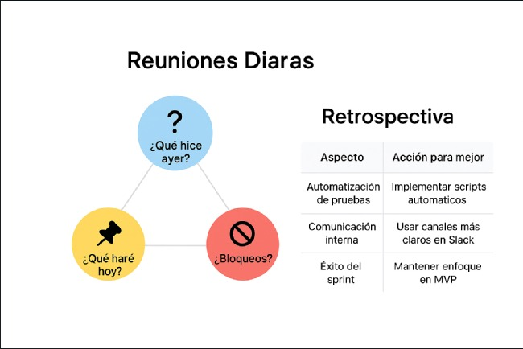
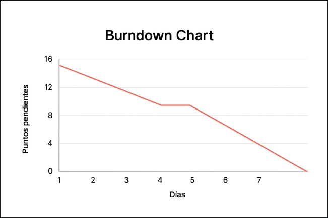

# 🥪 Sistema de Pedidos de Sándwiches (Consola)

Este proyecto es un **sistema de gestión de pedidos** para una franquicia de sándwiches, desarrollado en **Python** y pensado para ejecutarse desde **consola** 🖥️.  
Permite registrar usuarios, locales, pedidos y promociones, guardando la información en un archivo **JSON**.  

---

# Colaboradores

#   👦🏻 - Yhony Alexander Grajales Delgado - DS
#   👦🏻 - Juan David Gutiérrez Agaton - SM 
#   👦🏻 - Juan Pablo Barrera Diaz - PO

---

## 📂 Estructura de Carpetas

```
Por-consola-sistema-de-pedidos-de-sandwiches/
│
├── app/ # 📌 Lógica del programa
│ ├── init.py
│ ├── main.py # Menú principal
│ ├── storage.py # Manejo de la base de datos JSON
│ ├── users.py # Gestión de usuarios
│ ├── stores.py # Gestión de locales
│ ├── orders.py # Gestión de pedidos
│ ├── payments.py # Gestión de pagos
│ └── promotions.py # Gestión de promociones
│
├── data/ # 📌 Archivos de datos
│ └── database.json # Base de datos en formato JSON
│
├── run.py # 🚀 Punto de entrada para ejecutar el programa
└── README.md # 📖 Documentación del proyecto

```


---

## ⚙️ Requisitos

- Python **3.10+**  
- No necesita librerías externas (usa solo módulos estándar de Python) ✅

---

## ▶️ Cómo ejecutar el programa

1. Clona o descarga este repositorio.
2. Abre la terminal en la carpeta del proyecto:
   ```bash
   cd Por-consola-sistema-de-pedidos-de-sandwiches
   🚀 ejecuta desde el archivo run.py o escribe en la terminal "python run.py"

## 🖼️ Imagenes


---



---



---

